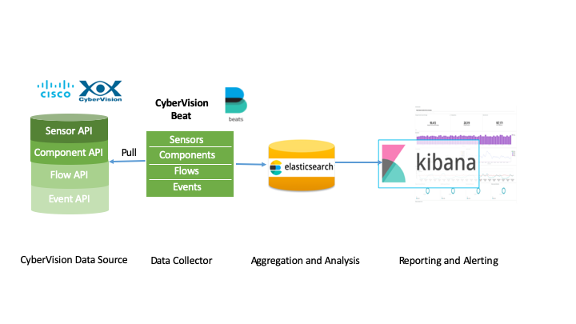
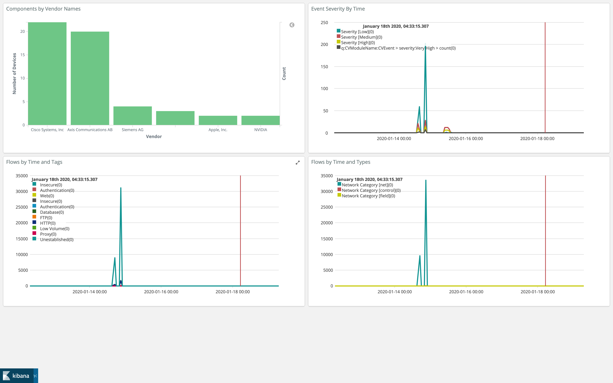

[](https://developer.cisco.com/codeexchange/github/repo/CiscoDevNet/icube-cybervision-plugin)
# icube-cybervision-plugin

This is an Elastic Beats (https://www.elastic.co/products/beats) plugin for the CyberVision API. 
The plugin polls the CyberVision APIs for CybverVision stats and allows sending stats
to Elasticsearch or any of output service supported by
Beats. (https://www.elastic.co/guide/en/logstash/current/output-plugins.html).

## icube-cybervision-plugin Data pipeline



### Sample dashboard
Sample Kibana dashboards are included as part of docker compose.

#### icube-cybervision-plugin API: sample dashboard



## Configuring icube-cybervision-plugin
Supports following plugin specific configs in the icube-cybervision-plugin.yml file

-  period: Polling interval, recommended value 10s to 600s
-  cvhost: URL for Cybervision API endpoint in format, https://192.168.1.10
-  cvkey:  CyberVision API token

Following are fields to control sections that will be collected by data collector.
'1' represent data that will be collected and '0' means data will be skipped (scangroup, scanreference, scanvariable, scantag, scanpropertyrule, and scanportrule have not been implemented in current version yet).

	- scancomponent:      1		Scan CyberVision Component API
	- scansensor:         1		Scan CyberVision Sensor API
	- scanflow:           1		Scan CyberVision Flow API
	- scangroup:          0
	- scanevent:          1		Scan CyberVision Event API
	- scanreference:      0
	- scanvariable:       0
	- scantag:            0
	- scanpropertyrule:   0
	- scanportrule:       0


All these field are configured in icube-cybervision-plugin.yml config file.


## Running icube-cybervision-plugin

### As docker-composer (**Recommended**)
https://github.com/CiscoDevNet/icube-cybervision-plugin/blob/master/docker-compose/README.md

### As binary
```
icube-cybervision-plugin -e -d *
```

## Building source code
https://github.com/CiscoDevNet/icube-cybervision-plugin/blob/master/DEVELOPMENT.md


## Using APIs

- CyberVision Sensor API
- CyberVision Component API
- CyberVision Event API
- CyberVision Flow API

These APIs enable analyzing CyberVision Components, Sensors, Events, and Flow Data to provide more detailed analytics data for Industrial Control Systems (ICS).

### CyberVision Sensor API

Retrieve list of sensors (active and inactive) used by Cyber Vision.

Route:

GET /api/1.0/sensor

Example:

GET /api/1.0/sensor?token=YOUR_TOKEN&status=active&status=inactive

Some of the key sensor parameters that CyberVision Sensor API accepts are:

	- status				: Sensor status, active or inactive
	- recording				: Recording status
	- recording_last_size	: last size of recording
	- name					: friendly name of sensor
	- recording_last_stop	: last stop time of recording
	- auto_config			: sensor is auto configured or not
	- flow_rate_day			: flow rate of day
	- creation_time			: creation time of sensor
	- flows_percentage		: flows percentage info
	- flow_count_day		: flow count of day
	- filter				: filter options
	- version				: version information
	- recording_last_start	: last start of recording
	- ip					: IP of sensor
	- serial_number			: Serial number of sensor
	- last_active_time		: Last active time of sensor
	- id					: ID of sensor

### CyberVision Component API

A Component is a node of the network. The API enables retrieval of the list of Components that have been created ordered by their last active time.

Route:

GET /api/1.0/component

Example:

Retrieve up to 5 live components with vendor "Siemens AG - Industrial Automation - EWA" and with property "s7plus-modulever" equal to "V4.0" and with property "s7plus- moduleref" and with tag "PLC".

GET /api/1.0/component?token=YOUR_TOKEN&vendor=Siemens+AG+-+Industrial+Automation+-+EWA&limit=5&generation=0&property=s7plus-modulever%3DV4.0&property=s7plus-moduleref&tag=PLC

Some of the key sensor parameters that CyberVision Component API accepts are:
	
	- id				: ID of component
	- creation_time		: Creation time of component
	- last_active_time	: Last active time of component
	- ip				: IP address
	- mac				: MAC address
	- name				: Name of Component
	- model_name		: Model name
	- model_ref			: Model reference
	- fw_version		: Firmware version
	- hw_version		: Hardware version
	- serial_number		: Serial number
	- vendor_name		: Vendor name
	- project_name		: Project name
	- project_version	: Project version
	- group				: Group name-group name will be used in getting Group API
	- tags				: Tags info
	- properties		: Properties
	- vulnerabilities	: Vulnerability list

Vulnerability that was discovered on components:

	- creation_time			: Creation time
	- last_update			: Last update
	- matching_time			: Matching time
	- id					: ID
	- cve					: CVE
	- vendor_id				: Vendor ID
	- title					: Title
	- summary				: Summary
	- full_description		: Full Description
	- solution				: Solution
	- CVSS					: CVSS
	- CVSS_temporal			: CVSS temporal
	- CVSS_vector_string	: CVSS vector string
	- links					: Relevant Links about Vulnerability

Links about Vulnerability:

	- id		: Link ID
	- title		: Title
	- link		: Link Url
	- order		: Order


### CyberVision Flow API

Route:

GET /api/1.0/flows/?token=YOUR_TOKEN

Example:

Retrieve flows between 2016-11-03 and 2017-11-14 12:05 with tags "Stop CPU" and "Write Var" with industrial as network category and has property "s7plus-moduleref" and with property "s7plus- modulever" equal to "V1.6" and with property "s7plus-io-ver" equal to "V2.0.2":

GET /api/1.0/flows/?token=YOUR_TOKEN&start=2016-11-03+00%3A00&tag=Stop+CPU&tag=Write+Var&limit=2&offset=0&generation=0&end=2017-11-14+12%3A05&property=s7plus-io-ver%3DV2.0.2&property=s7plus-modulever%3DV1.6&property=s7plus-moduleref&order=asc&netcat=field&netcat=control

CyberVision Flow API accepts the following parameters:

	- id				: ID
    - sensor_id			: Sensor ID
    - src 				: Flow source, refer to FlowEndPoint
	- dst					: Flow destination,refer to FlowEndPoint
    - network_category	: Network category, such as control, field...
	- ethertype			: EtherType,such as IPv4,IPv6
    - protocol			: Protocol, such as TCP, UDP
    - first_seen		: First seen time
	- properties		: Properties about the flow
	- last_seen			: Last seen time
	- tags				: Tags info about the flow

FlowEndPoint:

	- ip 			: IP address
	- port 			: Port
	- mac			: MAC address
	- component		: Component Info, ID

### CyberVision Event API

Route:

GET /api/1.0/event?token=YOUR_TOKEN

Example:

Retrieve the 5 events since 2016-11-03 00:00 with "Identification" as category related to a component that has "d4:ae:52:aa:dc:93" as MAC address:
GET /api/1.0/event?token=YOUR_TOKEN&category=Identification&start=2016-11-03+00%3A00&mac=d4%3Aae%3A52%3Aaa%3Adc%3A9

CyberVision Event API accepts the following parameters:

	- id				: ID
	- category			: Category
	- severity			: Severity, such as High,Medium,Low
	- family			: family, such as "Cisco Cyber vision",Component,Property,PLC Control...
	- component			: Component info, such as component id
	- creation_time		: Creation time
	- message			: Message description about the event
	- type				: Type, such as Classification,Behavioral...
	- short_message		: Short message about the event